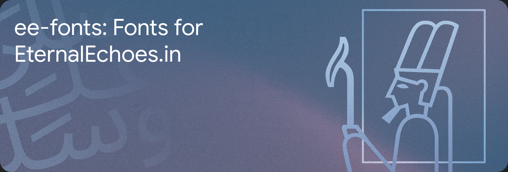

# EternalEchoes Fonts

This repository contains the fonts used in the EternalEchoes.in website.

## Fonts

There are many fonts used in the website. The fonts are listed below:

- [Noto Color Emoji](https://fonts.google.com/noto/specimen/Noto+Color+Emoji) - Used for the emoji in the website.
- [Noto Sans](https://fonts.google.com/noto/specimen/Noto+Sans) - Used for the english text in the website.
- [Noto Sans Devanagari](https://fonts.google.com/noto/specimen/Noto+Sans+Devanagari) - Used for the hindi text in the website.
- [Noto Sans Gujarati](https://fonts.google.com/noto/specimen/Noto+Sans+Gujarati) - Used for the gujarati text in the website.
- [Noto Sans Kannada](https://fonts.google.com/noto/specimen/Noto+Sans+Kannada) - Used for the kannada text in the website.
- [Noto Sans Malayalam](https://fonts.google.com/noto/specimen/Noto+Sans+Malayalam) - Used for the malayalam text in the website.
- [Noto Sans Tamil](https://fonts.google.com/noto/specimen/Noto+Sans+Tamil) - Used for the tamil text in the website.
- [Noto Sans Telugu](https://fonts.google.com/noto/specimen/Noto+Sans+Telugu) - Used for the telugu text in the website.
- [Noto Sans Bengali](https://fonts.google.com/noto/specimen/Noto+Sans+Bengali) - Used for the bengali text in the website.
- [Noto Sans Oriya](https://fonts.google.com/noto/specimen/Noto+Sans+Oriya) - Used for the oriya text in the website.
- [Noto Sans Ahom](https://fonts.google.com/noto/specimen/Noto+Sans+Ahom) - Used for the ahom text in the website.
- [Noto Sans Thai](https://fonts.google.com/noto/specimen/Noto+Sans+Thai) - Used for the thai text in the website.
- [Noto Sans Myanmar](https://fonts.google.com/noto/specimen/Noto+Sans+Myanmar) - Used for the myanmar text in the website.
- [Noto Sans Tibetan](https://fonts.google.com/noto/specimen/Noto+Sans+Tibetan) - Used for the tibetan text in the website.
- [Noto Sans Traditional Chinese](https://fonts.google.com/noto/specimen/Noto+Sans+TC) - Used for the traditional chinese text in the website.
- [Noto Sans Simplified Chinese](https://fonts.google.com/noto/specimen/Noto+Sans+SC) - Used for the simplified chinese text in the website.
- [Noto Sans Japanese](https://fonts.google.com/noto/specimen/Noto+Sans+JP) - Used for the japanese text in the website.
- [Noto Sans Korean](https://fonts.google.com/noto/specimen/Noto+Sans+KR) - Used for the korean text in the website.
- [Noto Sans Meetei Mayek](https://fonts.google.com/noto/specimen/Noto+Sans+Meetei+Mayek) - Used for the meetei mayek text in the website.
- [Noto Sans Gurumukhi](https://fonts.google.com/noto/specimen/Noto+Sans+Gurmukhi) - Used for the gurumukhi text in the website.
- [Poppins](https://fonts.google.com/specimen/Poppins) - Used for the headings in the website.

## License

The fonts are licensed under the [SIL Open Font License](https://scripts.sil.org/cms/scripts/page.php?site_id=nrsi&id=OFL). The license can be found in the `LICENSE` file in each font folder.

## Credits

The fonts are created by [Google](https://www.google.com/). The fonts are hosted on [Google Fonts](https://fonts.google.com/). But for the sake of simplicity, the fonts are hosted on this repository and will be served from our servers.

## Contributing

If you want to change the fonts, you can fork this repository and make a pull request. If you want to add a new font, you can create an issue and we will add the font if it is suitable for the website.

## Issues

If you find any issues with the fonts, you can create an issue and we will try to fix it as soon as possible.

## Contact

If you want to contact us, you can send an email to [me@notcoderguy.com](mailto:me@notcoderguy.com]) or you can contact me on Discord at `notcoderguy`.
